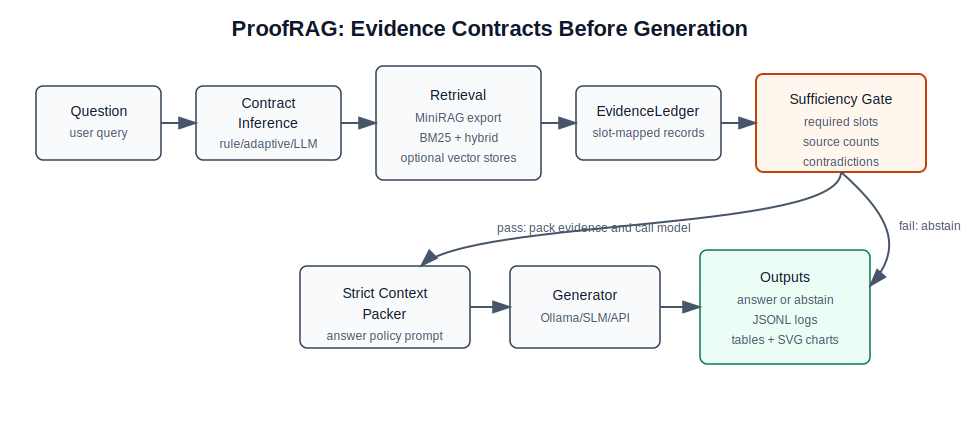

# ProofRAG v0.1

> **Evidence-contracted RAG for small language models.**

MiniRAG makes lightweight RAG graph-aware.
**ProofRAG makes lightweight RAG evidence-aware.**

Before a language model is allowed to answer, ProofRAG verifies that the
retrieved evidence satisfies a declarative *EvidenceContract* — a typed
specification of what evidence is required, how many sources are needed per
slot, and whether contradictions should block the answer.  If the contract is
not satisfied, the model is instructed to report incompleteness rather than
hallucinate.

---

## Current Status

ProofRAG v0.1 is a functional research framework for evidence-gated RAG. It
establishes the architectural patterns needed to test whether explicit evidence
contracts reduce unsafe generation in small language model pipelines:

- **Evidence Contracts**: Pydantic-based schemas for declaring required evidence.
- **Adaptive Contracts**: Optional deterministic strengthening for high-risk or multi-hop questions.
- **Evidence Ledger**: In-memory storage for retrieved evidence records.
- **Sufficiency Scoring**: Rule-based logic to determine if evidence meets the contract.
- **Strict Context Packing**: Prompt engineering that explicitly gates generation.
- **Configurable Runs**: YAML/JSON runtime settings plus CLI overrides.
- **Experiment Logging**: JSONL-based tracking of pipeline artifacts, run config, and summary fields.
- **Quality Gates**: Pytest, Ruff, mypy, package build, and CI workflow coverage.
- **CLI**: End-to-end command-line interface for testing the pipeline.
- **MiniRAG/LightRAG Export Adapter**: ProofRAG gating over normalized external RAG JSONL exports.
- **Evaluation Reporting**: Metrics, paired comparisons, error buckets, Markdown tables, and SVG charts.
- **Faithfulness Metrics**: Claim-level groundedness plus optional LLM judge parsing.
- **LiHua-World Evaluation Wrapper**: MiniRAG export evaluation, source-resolution checks, and publication artifact scripts.
- **Claim Validation**: Fail-closed checks for external completion gates and full-benchmark superiority claims.
- **Release Checks**: One-command local verification with structured JSON evidence.
- **Human Evaluation Export**: JSONL normalization for manual review workflows.
- **LLM Backends**: Dummy, Ollama, transformers, and OpenAI-compatible HTTP generation backends.
- **BM25 + Hybrid Retrieval**: Dependency-light lexical retrieval and contract-aware reranking over JSON corpora.
- **Iterative Retrieval**: Optional contract-gap guided retries for missing evidence slots.

**What is NOT included yet:**
- **Vector stores are optional**: FAISS, Chroma, and LanceDB adapters require their corresponding extras.
- **Full LiHua-World data is external**: the evaluation wrapper expects normalized MiniRAG exports and optional local LiHua source files.
- **No published quantitative win claims yet**: reported numbers remain diagnostic until full external LiHua/MiniRAG artifacts are generated and reviewed.
- **Publication claims are gated**: use `scripts/check_completion_gates.py` and `scripts/validate_publication_claims.py` before promoting results beyond smoke-test diagnostics.
- **Local release evidence is reproducible**: use `scripts/run_local_release_checks.py` to run and record the full local verification set.

Next milestone: **rigorous MiniRAG vs MiniRAG+ProofRAG evaluation over full external LiHua-World artifacts.**

---

## Architecture

See [docs/architecture.md](docs/architecture.md) for the detailed component
map and pipeline notes.



See [docs/completion_audit.md](docs/completion_audit.md) for the current
roadmap-to-artifact audit and remaining external verification gates.
See [docs/roadmap_artifact_matrix.md](docs/roadmap_artifact_matrix.md) for the
machine-checkable prompt-to-artifact roadmap matrix.
See [docs/results_snapshot.md](docs/results_snapshot.md) for the current
limited LiHua smoke-result snapshot.

```
proofrag/
  contracts/        EvidenceSlot, EvidenceContract (Pydantic schemas)
  evidence/         EvidenceRecord, EvidenceLedger, SufficiencyReport,
                    RuleBasedSufficiencyScorer
  packing/          StrictContextPacker — assembles the evidence-gated prompt
  retrieval/        DummyRetriever — deterministic fixture backend
                   BM25Retriever — dependency-light lexical retrieval
                   HybridRetriever — BM25 candidates + contract-aware reranking
                   FAISS/Chroma/LanceDB — optional vector retrieval adapters
                   ContractGapRetriever — iterative missing-slot retrieval
  generation/       DummyGenerator — deterministic fixture backend
                   OllamaGenerator — optional local model backend
                   OpenAICompatibleGenerator — SDK-free /chat/completions backend
                   TransformersGenerator — optional local transformers backend
  config.py         Pydantic runtime settings loaded from YAML/JSON
  cli.py            Typer CLI — `python -m proofrag.cli ask --question "..."`
```

---

## Quickstart

```bash
# Install in editable mode
pip install -e ".[dev]"

# Run the demo question end-to-end
python -m proofrag.cli ask --question "Who asked LiHua about the laptop warranty issue?"

# Run with the default YAML config and write a specific JSONL log
python -m proofrag.cli ask \
  --question "Who asked LiHua about the laptop warranty issue?" \
  --config configs/default.yaml \
  --output experiments/results/demo.jsonl

# Run all tests
pytest

# Run the toy benchmark
python scripts/run_toy_benchmark.py

# Summarize a JSONL experiment log
python scripts/summarize_experiment_log.py \
  --input experiments/results/demo.jsonl \
  --summary-json experiments/results/demo_summary.json \
  --table-md experiments/results/demo_summary.md
```

## Configuration

ProofRAG runs can be reproduced from a YAML or JSON config file. The default
configuration is `configs/default.yaml` and keeps the stack lightweight:

```yaml
retriever:
  backend: dummy

generator:
  backend: dummy

contract:
  inference: demo

logging:
  output_path: experiments/results/run_001.jsonl
```

CLI flags override config values:

```bash
python -m proofrag.cli ask \
  --question "Who asked LiHua about the laptop warranty issue?" \
  --config configs/default.yaml \
  --generator ollama \
  --retriever hybrid \
  --iterative \
  --model qwen3.5:4b \
  --contract-inference adaptive \
  --output experiments/results/qwen35_run.jsonl
```

For an OpenAI-compatible local or hosted endpoint:

```bash
python -m proofrag.cli ask \
  --question "Who asked LiHua about the laptop warranty issue?" \
  --config configs/default.yaml \
  --generator openai-compatible \
  --model local-model \
  --output experiments/results/openai_compatible_run.jsonl
```

Environment variables are also supported for API and container deployments.
`PROOFRAG_CONFIG` points to a YAML/JSON config file; scalar `PROOFRAG_*`
variables override file/default values:

```bash
PROOFRAG_CONFIG=configs/default.yaml \
PROOFRAG_RETRIEVER_BACKEND=hybrid \
PROOFRAG_GENERATOR_BACKEND=dummy \
PROOFRAG_CONTRACT_INFERENCE=adaptive \
python -m proofrag.cli ask \
  --question "Who asked LiHua about the laptop warranty issue?" \
  --json
```

Common environment overrides include `PROOFRAG_CONTEXT_PATH`,
`PROOFRAG_TOP_K`, `PROOFRAG_ITERATIVE_RETRIEVAL`,
`PROOFRAG_MAX_RETRIEVAL_ROUNDS`, `PROOFRAG_GENERATOR_MODEL`,
`PROOFRAG_GENERATOR_BASE_URL`, `PROOFRAG_GENERATOR_API_KEY`,
`PROOFRAG_GENERATOR_TIMEOUT`, `PROOFRAG_TEMPERATURE`, `PROOFRAG_MAX_TOKENS`,
`PROOFRAG_ENDPOINT_MODE`, `PROOFRAG_OUTPUT_PATH`, and
`PROOFRAG_CONTRACT_INFERENCE`.

---

## Toy Benchmark Harness

ProofRAG includes a toy benchmark harness to verify its evidence-gating behavior against expected outcomes.

- **What it tests**: 
  - Direct vs. Indirect evidence enforcement.
  - Required slot coverage.
  - Multi-source requirements.
  - Contradiction blocking in strict mode.
- **How to run**:
  ```bash
  python scripts/run_toy_benchmark.py
  ```
- **Dataset**: `benchmarks/toy_lihua.jsonl` contains 30 curated scenarios based on the LiHua-World context.
- **Results**: Detailed results are written to `experiments/results/toy_benchmark_results.jsonl`.

*Note: This is a diagnostic tool for ProofRAG's internal logic. Integration with the full MiniRAG pipeline is the next milestone.*

## Evaluation Utilities

Reusable package utilities under `proofrag.evaluation` support reproducible
reports without heavyweight plotting/dataframe dependencies:

- `calculate_metrics(...)` for abstention, unsafe allow, precision-at-answered,
  latency, and token summaries.
- `claim_level_faithfulness(...)` for deterministic groundedness scoring and
  `judge_faithfulness_with_llm(...)` for optional judge-model output parsing.
- `scripts/score_faithfulness.py --scorer llm-judge` for reproducible
  MiniRAG-vs-ProofRAG faithfulness summaries with Ollama, OpenAI-compatible,
  or transformers judge backends.
- `compare_minirag_vs_proofrag(...)` for paired MiniRAG vs MiniRAG+ProofRAG
  summaries.
- `bootstrap_mean_ci(...)` and `paired_binary_comparison(...)` for confidence
  intervals and exact paired binary tests.
- `analyze_errors(...)` for stable error buckets.
- `benchmark_metrics_markdown(...)`, `comparison_markdown(...)`, and
  `bar_chart_svg(...)` for report artifacts.

Prepare a human-evaluation JSONL from an experiment result file:

```bash
python scripts/prepare_human_eval.py \
  --input experiments/results/proofrag_over_minirag_model_results.jsonl \
  --output experiments/results/human_eval_items.jsonl
```

Generate reproducible MiniRAG vs MiniRAG+ProofRAG report artifacts:

```bash
python scripts/compare_minirag_proofrag.py \
  --input experiments/results/proofrag_over_minirag_results.jsonl \
  --summary-json experiments/results/comparison_summary.json \
  --table-md experiments/results/comparison_table.md \
  --chart-svg experiments/results/comparison_chart.svg
```

Run the LiHua/MiniRAG evaluation wrapper and publication artifact pipeline:

```bash
python scripts/run_lihua_eval.py \
  --minirag-export experiments/results/minirag_export.jsonl \
  --output experiments/results/proofrag_over_minirag_results.jsonl \
  --summary-json experiments/results/comparison_summary.json \
  --table-md experiments/results/comparison_table.md \
  --chart-svg experiments/results/comparison_chart.svg

python scripts/run_ablation.py \
  --run hybrid=experiments/results/proofrag_over_minirag_results.jsonl \
  --summary-json experiments/results/ablation_summary.json \
  --table-md experiments/results/ablation_table.md \
  --chart-svg experiments/results/ablation_chart.svg

python scripts/make_publication_tables.py \
  --comparison-json experiments/results/comparison_summary.json \
  --ablation-json experiments/results/ablation_summary.json \
  --output-md experiments/results/publication_tables.md

# Or run the bundled end-to-end artifact pipeline
bash scripts/reproduce_paper_results.sh \
  benchmarks/sample_minirag_export.jsonl \
  experiments/results/reproducible
```

## API Server

FastAPI support is optional:

```bash
pip install -e ".[api]"
uvicorn proofrag.api.main:app --host 0.0.0.0 --port 8000
```

LLM-assisted contract inference is available with any configured generator:

```bash
python -m proofrag.cli ask \
  --question "Who asked LiHua about the laptop warranty issue?" \
  --contract-inference llm \
  --generator ollama \
  --model qwen3.5:4b
```

Transformers generation is optional:

```bash
pip install -e ".[transformers]"
python -m proofrag.cli ask \
  --question "Who asked LiHua about the laptop warranty issue?" \
  --generator transformers \
  --model TinyLlama/TinyLlama-1.1B-Chat-v1.0
```

Docker:

```bash
docker build -t proofrag .
docker run --rm -p 8000:8000 proofrag

# Or use Compose
docker compose up --build
```

Release evidence:

```bash
python scripts/run_local_release_checks.py \
  --output-dir experiments/results/local_release_checks
```

When full external LiHua/MiniRAG artifacts exist, add
`--require-external-gates`, the `--lihua-*`, `--minirag-export`,
comparison/faithfulness/review, Docker, CI, and claim-threshold flags shown in
[docs/reproducibility.md](docs/reproducibility.md). Remote CI uploads the same
release evidence bundle as `proofrag-release-evidence` on the Python 3.11 lane.
Use that artifact, or a saved `gh run view --json conclusion` output, as
`--ci-evidence`; a run URL alone is only supporting context.
Use `scripts/write_external_evidence_manifest.py` to generate a reviewer-facing
artifact checklist plus the exact gate and release commands for those paths.
The completion gate validates both artifact presence and the configured
publication-claim thresholds before setting `ready_for_superiority_claim=true`.

---

## MiniRAG Output Adapter

ProofRAG can ingest and validate results exported from external RAG systems like
MiniRAG and LightRAG when they use the normalized JSONL export schema.

- **Purpose**: This adapter bridges external research baselines with ProofRAG's evidence-gated verification. It consumes a normalized JSONL export format.
- **Evidence Inference**: The adapter uses heuristic rules to map raw retrieved context into `EvidenceRecord` objects with inferred slots and strength.
- **LightRAG Compatibility**: `LightRAGOutputAdapter` accepts the same schema;
  set `baseline_method` to `lightrag` so reports preserve the upstream method.
- **Demo**: Run the adapter demo to see how ProofRAG gates a simulated MiniRAG run:
  ```bash
  python scripts/run_minirag_adapter_demo.py
  ```
- **Exporter Helper**: `tools/external/minirag_exporter.py` validates the normalized export schema and can call an external MiniRAG checkout with `only_need_context=True` when that dependency is available.

---

## External MiniRAG Exporter

An optional helper tool is provided to export real MiniRAG results for evaluation.

- **Non-Vendoring**: This tool stays in `tools/external/` and does not include MiniRAG code.
- **Dry-Run**: Test the schema without MiniRAG:
  ```bash
  python tools/external/minirag_exporter.py \
    --qa-file benchmarks/toy_lihua.jsonl \
    --output experiments/results/minirag_dry_run.jsonl \
    --dry-run
  ```
- **Evaluation**: The exported JSONL can be loaded by `MiniRAGOutputAdapter` for ProofRAG verification.

---

## ProofRAG over MiniRAG exports

Run ProofRAG's evidence-gated verification over real or simulated MiniRAG exports.

- **Command**:
  ```bash
  python scripts/run_proofrag_over_minirag.py \
    --input benchmarks/sample_minirag_export.jsonl \
    --output experiments/results/proofrag_over_minirag_results.jsonl
  ```
- **Analysis**: This runner applies ProofRAG's `StrictContextPacker` and `RuleBasedSufficiencyScorer` to external contexts, providing a behavioral analysis of where the baseline system may have succeeded or failed to meet evidence requirements.

> [!TIP]
> **Qwen 3.5** and other "thinking" models should use Ollama's **chat** mode (default) with `think=false`. Using the standard `generate` mode may result in empty visible responses if the model spends all tokens in the internal thinking field.

---

## Run with a real local model

ProofRAG supports local model generation using [Ollama](https://ollama.com/). We prioritize lightweight models that can run on consumer hardware.

### Setup
1. Install Ollama and start the server (`ollama serve`).
2. Pull the recommended models:
   ```bash
   ollama pull qwen3.5:4b
   ollama pull gemma4:e4b
   ```

> [!NOTE]
> We start with **Qwen 3.5 4B** (default) and **Gemma 4 e4b** (comparison) because ProofRAG targets small/local-model RAG. Larger models can be tested later, but the first benchmark should stay in the lightweight setting. Fallback models include `gemma3:4b` and `qwen3:4b`.

### Run Toy Benchmark with Model
Evaluate ProofRAG's performance using real LLM responses:
```bash
# Using default model (qwen3.5:4b)
python scripts/run_toy_benchmark_with_model.py \
  --dataset benchmarks/toy_lihua.jsonl \
  --output experiments/results/toy_benchmark_model_qwen35_4b.jsonl \
  --model qwen3.5:4b

# Using comparison model (gemma4:e4b)
python scripts/run_toy_benchmark_with_model.py \
  --dataset benchmarks/toy_lihua.jsonl \
  --output experiments/results/toy_benchmark_model_gemma4_e4b.jsonl \
  --model gemma4:e4b
```

### Run Experiment over MiniRAG exports
Compare ProofRAG-generated answers against baseline MiniRAG answers:
```bash
python scripts/run_proofrag_over_minirag_with_model.py \
  --input benchmarks/sample_minirag_export.jsonl \
  --output experiments/results/proofrag_over_minirag_model_results.jsonl \
  --model qwen3.5:4b
```

*Note: By default, ProofRAG will **abstain** (return a fixed message without calling the model) if the evidence sufficiency check fails.*

---

## Current Toy Benchmark Result

Initial deterministic evaluations using the toy benchmark dataset
(`benchmarks/toy_lihua.jsonl`) show that the rule-based gate matches the
expected allow/block labels for the curated cases.

| Run | Total | Abstained | Answered | Behavioural Pass Rate | Unsafe Allow Rate |
| :--- | :--- | :--- | :--- | :--- | :--- |
| **Rule-based gate** | 30 | 16 | 14 | 100% | 0% |

- **Safe Gating**: ProofRAG blocks examples with missing direct evidence,
  insufficient source count, indirect-only evidence, or contradictions.
- **Note**: This is a diagnostic toy benchmark designed to verify pipeline
  logic. It is not a final research result on the full LiHua-World dataset.

---

## Core Concepts

| Concept | Description |
|---|---|
| **EvidenceContract** | Declares what evidence a question requires before answering is allowed |
| **EvidenceSlot** | One required evidence category with `min_sources` enforcement |
| **EvidenceLedger** | Runtime store of retrieved `EvidenceRecord`s |
| **SufficiencyReport** | Auditable pass/fail decision from `RuleBasedSufficiencyScorer` |
| **StrictContextPacker** | Packs evidence + policy into a structured prompt that gates the LM |

---

## Roadmap

- **v0.2** — Retrieval backends (BM25/hybrid now, optional dense vector stores next)
- **v0.3** — Additional generation integrations (transformers and OpenAI-compatible HTTP)
- **v0.4** — Full LiHua-World and MiniRAG comparison harness

## Publication Notes

- Reproducibility commands: [docs/reproducibility.md](docs/reproducibility.md)
- Draft paper abstract: [docs/paper_abstract.md](docs/paper_abstract.md)

## External baselines

ProofRAG is designed to be compared against state-of-the-art lightweight RAG systems.

- **MiniRAG**: For inspection and reproduction, MiniRAG is cloned into `../external/MiniRAG`.
- **Reproducibility**: MiniRAG source code and datasets are **not** vendored into this repository. ProofRAG interacts with external baselines through exported JSONL results and adapter layers (see `docs/minirag_adapter_plan.md`).

---

## License

MIT
